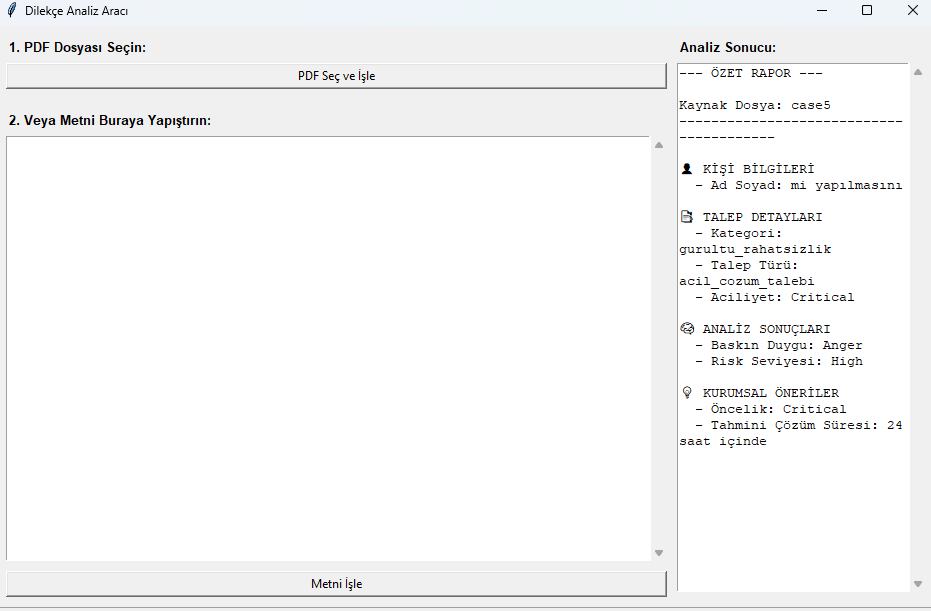
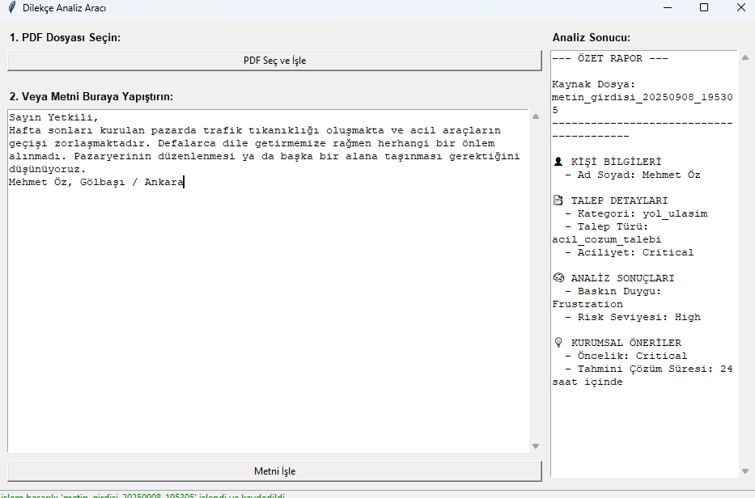

##  Proje Hakkında

Bu projenin temel amacı programa gönderilen dilekçeden  bilgi çıkarımı yapabilmektir.

###  Özellikler

* Metin ön işleme 
* Kural tabanlı bilgi çıkarımı
* Duygusal momentum takibi
* Makine öğrenmesi ile sınıflandırma
* Makine öğrenmesi için veri tabanı oluşturma algoritması

##  Kullanılan Teknolojiler

* Python 3.9
* Scikit-learn
* Pandas & NumPy
* PyCharm IDE 

## Kurulum

Projeyi yerel makinenizde çalıştırmak için aşağıdaki adımları izleyin.

1.  **Projeyi klonlayın:**
    ```sh
    git clone [https://github.com/barisgevher/case_study_kornext_second_demo]
    
    cd proje-adiniz
    ```

2.  **Sanal ortam (virtual environment) oluşturun ve aktifleştirin:**
    ```sh
    python -m venv venv
    source venv/bin/activate  # Windows için: venv\Scripts\activate
    ```

3.  **Gerekli kütüphaneleri yükleyin:**
    ```sh
    pip install -r requirements.txt
    ```
4. **Projenin kök dizininde şu komutu çalıştırın**
```sh
   python main.py
```

**Karşınıza çıkan ekrana pdf seç ve işle diyerek bir pdf seçerseniz şu şekilde bir sonuçla karşılaşırsınız**



**Eğer hazırda metin halinde bir veriniz varsa hızlıca işlemek için metin giriş kısmını kullanabilirsiniz**




**İşleme sonuçlarının ham json ve detaylı halleri**


<details>
<summary><strong>JSON Verisinin Tamamını Görmek İçin Tıklayın</strong></summary>

JSON
```
{
    "metadata": {
        "analysis_timestamp": 1757353676.760286,
        "processing_time_seconds": 0.0353,
        "algorithm_version": "rbcd-v2.0_ULTRA",
        "confidence_level": 0.621
    },
    "extracted_information": {
        "person_name": "Fatma Şen",
        "address_info": null,
        "institution": "Müdürlük",
        "subject_category": "egitim",
        "urgency_level": "medium",
        "request_type": "acil_cozum_talebi",
        "extraction_methods": {
            "name": {
                "extracted_name": "Fatma Şen",
                "confidence": 0.11000000000000001,
                "all_candidates": [
                    "bu durum",
                    "Fatma Şen"
                ],
                "extraction_methods": {
                    "signature_patterns": [
                        "bu durum"
                    ],
                    "positional_analysis": [
                        "Fatma Şen"
                    ],
                    "context_based": [],
                    "address_combined": [],
                    "contact_combined": []
                },
                "method_scores": {
                    "bu durum": 1.0,
                    "Fatma Şen": 1.1
                }
            },
            "institution": {
                "institution": "Müdürlük",
                "confidence": 0.7,
                "authority_level": "authority_titles",
                "extraction_method": "pattern_matching",
                "all_candidates": [
                    {
                        "name": "Müdürlük",
                        "level": "authority_titles",
                        "confidence": 0.7
                    },
                    {
                        "name": "Sayın",
                        "level": "authority_titles",
                        "confidence": 0.7
                    }
                ]
            },
            "category": {
                "primary_category": "egitim",
                "confidence": 0.5263157894736842,
                "all_categories": {
                    "yapim_insaat": 8.399999999999999,
                    "egitim": 16.0,
                    "okul_sorunu": 6.0
                },
                "category_details": {
                    "yapim_insaat": {
                        "primary_matches": [
                            [
                                "yapı",
                                1
                            ],
                            [
                                "taş",
                                1
                            ]
                        ],
                        "secondary_matches": [],
                        "context_matches": [],
                        "problem_matches": [
                            "risk"
                        ],
                        "total_score": 8.399999999999999
                    },
                    "egitim": {
                        "primary_matches": [
                            [
                                "okul",
                                1
                            ],
                            [
                                "öğrenci",
                                1
                            ],
                            [
                                "öğretmen",
                                1
                            ],
                            [
                                "müdür",
                                1
                            ]
                        ],
                        "secondary_matches": [
                            [
                                "ders",
                                1
                            ]
                        ],
                        "context_matches": [],
                        "problem_matches": [],
                        "total_score": 16.0
                    },
                    "okul_sorunu": {
                        "primary_matches": [
                            [
                                "montla ders işliyor",
                                1
                            ],
                            [
                                "kış ayları",
                                1
                            ]
                        ],
                        "secondary_matches": [],
                        "context_matches": [],
                        "problem_matches": [],
                        "total_score": 6.0
                    }
                },
                "classification_method": "ultra_comprehensive",
                "score_distribution": {
                    "yapim_insaat": 0.2763157894736842,
                    "egitim": 0.5263157894736842,
                    "okul_sorunu": 0.19736842105263158
                }
            },
            "urgency": {
                "level": "medium",
                "scores": {
                    "critical": 0.0,
                    "high": 0,
                    "medium": 0,
                    "low": 0
                },
                "repetition_score": 0,
                "emotional_amplifier": 1.06,
                "confidence": 0.0
            },
            "request_type": {
                "type": "acil_cozum_talebi",
                "confidence": 0.3,
                "all_scores": {
                    "acil_cozum_talebi": 3.0,
                    "normal_cozum_talebi": 2.0
                },
                "detailed_matches": {
                    "acil_cozum_talebi": {
                        "matches": [
                            [
                                "yapılmasını",
                                1
                            ]
                        ],
                        "score": 3.0,
                        "weight": 3.0
                    },
                    "normal_cozum_talebi": {
                        "matches": [
                            [
                                "yapılmasını",
                                1
                            ]
                        ],
                        "score": 2.0,
                        "weight": 2.0
                    }
                },
                "classification_method": "weighted_keyword_analysis"
            }
        },
        "cross_validation_score": 0.524,
        "extraction_details": {
            "name_confidence": 0.11000000000000001,
            "category_confidence": 0.5263157894736842
        }
    },
    "emotional_intelligence": {
        "momentum_analysis": {
            "sentence_flow": [
                {
                    "sentence_index": 0,
                    "emotions": {
                        "anger": 1.0,
                        "desperation": 0.0,
                        "politeness": 0.0,
                        "frustration": 0.0
                    },
                    "cumulative_momentum": {
                        "anger": 1.0,
                        "desperation": 0.0,
                        "politeness": 0.0,
                        "frustration": 0.0
                    },
                    "dominant_emotion": "anger"
                },
                {
                    "sentence_index": 1,
                    "emotions": {
                        "anger": 0.0,
                        "desperation": 0.0,
                        "politeness": 0.0,
                        "frustration": 0.0
                    },
                    "cumulative_momentum": {
                        "anger": 0.8,
                        "desperation": 0.0,
                        "politeness": 0.0,
                        "frustration": 0.0
                    },
                    "dominant_emotion": "anger"
                },
                {
                    "sentence_index": 2,
                    "emotions": {
                        "anger": 0.0,
                        "desperation": 1.0,
                        "politeness": 0.0,
                        "frustration": 0.0
                    },
                    "cumulative_momentum": {
                        "anger": 0.6400000000000001,
                        "desperation": 1.0,
                        "politeness": 0.0,
                        "frustration": 0.0
                    },
                    "dominant_emotion": "desperation"
                },
                {
                    "sentence_index": 3,
                    "emotions": {
                        "anger": 0.0,
                        "desperation": 0.0,
                        "politeness": 0.0,
                        "frustration": 0.0
                    },
                    "cumulative_momentum": {
                        "anger": 0.5120000000000001,
                        "desperation": 0.9,
                        "politeness": 0.0,
                        "frustration": 0.0
                    },
                    "dominant_emotion": "anger"
                }
            ],
            "final_momentum": {
                "anger": 0.5120000000000001,
                "desperation": 0.9,
                "politeness": 0.0,
                "frustration": 0.0
            },
            "dominant_overall": "desperation",
            "emotional_stability": 0.95
        },
        "dominant_emotion": "desperation",
        "emotional_stability": 0.95,
        "predicted_citizen_state": {
            "psychological_state": "neutral_citizen",
            "confidence": 0.5,
            "stability_level": "medium",
            "intervention_suggestions": [
                "Standart yaklaşım"
            ]
        }
    },
    "social_intelligence": {
        "citizen_profile": {
            "age_group": "middle_aged",
            "family_status": "has_family",
            "economic_level": "middle",
            "education_level": "high",
            "civic_engagement": "low"
        },
        "social_signals": {
            "family_status_has_family": [
                "çocuk",
                "çocuğ"
            ],
            "education_level_high_education": [
                "öğretmen"
            ],
            "education_level_formal_language": [
                "gereği"
            ]
        },
        "engagement_level": "moderately_engaged"
    },
    "validation_report": {
        "primary_validation": {
            "overall_validity": true,
            "confidence_adjustment": 0.6,
            "validation_details": {
                "name": {
                    "is_valid": true,
                    "issues": [],
                    "turkish_bonus": 0.1,
                    "confidence": 1.1
                },
                "consistency": {
                    "is_consistent": false,
                    "issues": [
                        "Dil tutarsızlığı: Formal ve günlük dil karışımı"
                    ],
                    "confidence": 0.6
                }
            },
            "red_flags": [
                "İçerik tutarsızlıkları tespit edildi"
            ],
            "quality_score": 0.65
        },
        "enhanced_validation": {
            "overall_validity": false,
            "confidence_adjustment": 0.42,
            "validation_details": {
                "name": {
                    "is_valid": true,
                    "issues": [],
                    "turkish_bonus": 0.1,
                    "confidence": 1.1
                },
                "category": {
                    "is_valid": false,
                    "issues": [
                        "Bilinmeyen kategori"
                    ],
                    "confidence": 0.1
                },
                "consistency": {
                    "is_consistent": false,
                    "issues": [
                        "Dil tutarsızlığı: Formal ve günlük dil karışımı"
                    ],
                    "confidence": 0.6
                }
            },
            "red_flags": [
                "Kategori ataması şüpheli",
                "İçerik tutarsızlıkları tespit edildi"
            ],
            "quality_score": 0.42,
            "corrections_applied": []
        },
        "overall_validity": false,
        "quality_score": 0.42,
        "red_flags": [
            "Kategori ataması şüpheli",
            "İçerik tutarsızlıkları tespit edildi"
        ],
        "confidence_adjustment": 0.42
    },
    "creative_insights": {
        "citizen_urgency_profile": "Standart işlem sırası uygun profil",
        "communication_style_analysis": {
            "style": "informal",
            "emotional_intensity": {
                "anger": 0.5120000000000001,
                "desperation": 0.9,
                "politeness": 0.0,
                "frustration": 0.0
            },
            "social_awareness": 0.7,
            "recommended_response_tone": "Profesyonel ve anlayışlı"
        },
        "predicted_satisfaction_level": {
            "predicted_score": 0.252,
            "satisfaction_level": "low"
        },
        "institutional_response_recommendation": {
            "response_priority": "medium",
            "suggested_timeline": "5-7 işgünü",
            "communication_approach": "standard"
        },
        "risk_assessment": {
            "risk_score": 0.3,
            "risk_level": "low",
            "risk_factors": [],
            "mitigation_suggestions": [
                "Standart prosedür uygulanmalı"
            ]
        }
    },
    "actionable_recommendations": [],
    "kaynak_dosya": "case8"
}
```
</details>

  


